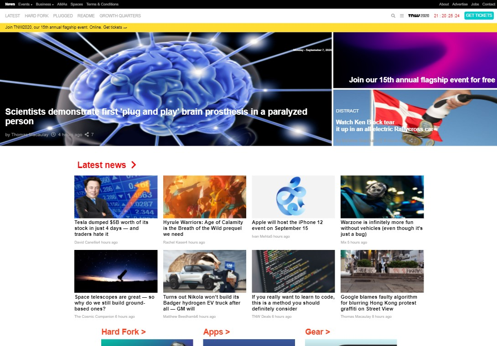

# Design Teardown

> The Next Web webpage clone using HTML & CSS and media query for responsiveness

## Built With

-HTML
-CSS

## Live Demo

[Live Demo Link](https://410AngelaVu.github.io/Responsive-Design/)

## Authors

👤 **Natalia Veronica Macias Ortiz**

- Github: [@NataJenkins](https://github.com/Takhmina175)
- Twitter: [@NataJenkins](https://twitter.com/NataJenkins)
- Linkedin: [linkedin Profile](https://www.linkedin.com/in/natalia-macias-a11a20187/)

👤 **Andjela Vukadinovic**

- GitHub: [@410AngelaVu](https://github.com/410AngelaVu)
- Twitter: [@twitterhandle](https://twitter.com/AngelaVu)
- LinkedIn: [LinkedIn](https://www.linkedin.com/in/andjela-vukadinovic-67a21b1b2/)

## 🤝 Contributing

Contributions, issues, and feature requests are welcome!

Feel free to check the [issues page](issues/).

## Show your support

Give a ⭐️ if you like this project!

## Acknowledgments

- Hat tip to anyone whose code was used
- Inspiration
- etc

## 📝 License

This project is [MIT](lic.url) licensed.
